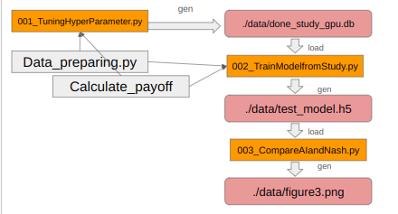

# tqnopt_test
# Neural Network Optimization with Optuna

This repository demonstrates the optimization of neural network hyperparameters using Optuna, a hyperparameter optimization framework.

## Summary

Optuna is used to perform hyperparameter optimization on a neural network model. This involves tuning various hyperparameters such as learning rate, batch size, number of layers, activation functions, etc., to improve the performance of the neural network. This repository tests optuna's work. The Desigin of programs are below. \

## Contents

- `001_TuningHyperParameter.py`: Python script utilizing Optuna to optimize hyperparameters.NOTE:Please memorize the RDB's name when you run it.
- `002_TrainModelfromStudy.py`: create neural network from optimized hyperparameters. It is required to add RDB's name.
- `003_CompareAIandNash.py`:using pre-learned AI, describe the predicted gain.
- `004_CheckLastFig.py(option)`:check latest figure.
- `README.md`: Instructions and details about the repository.
